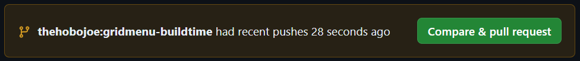

# Why git?
At a basic level, git is a version control software, it tracks changes to primarily text files, and for every single change committed, it allows you to go back to *any* version of *any* file in the repository. This alone is extremely useful even when working solo, to keep track of changes as well as identify bugs and regressions from specific changes.

At a higher level, its purpose is to allow large groups of people to work on the same set of files with minimal clashing, and to make forks and branches of existing code to develop new changes in a safe environment.

# External resources
This is of course just a brief overview of the capabilities of git - but git is incredibly powerful and complex, so here are some extra resources that will help you learn more advanced capabilities, or just get more detailed explanations on the concepts described here.
https://githowto.com/

# Git and BAR
BAR of course is hosted on Github, and in order to contribute to the codebase in any way at least a very baseline knowledge of git is required - for those with permissions to push to master, the only knowledge strictly required is clone, pull, commit, and push. For those without any permissions to the repo, at the very least the user must understand forking on github, cloning, pulling, branching, merging, pushing, and managing more than one remote.

Some of that knowledge takes time to develop, and the purpose of this document is to not only teach users how to do all of these things, but also to provide certain solutions that will lower the barrier to entry (or in some cases, simply remove extra tedium) for more users.

While there are several freely available git GUI applications (e.g. github desktop, or sublime merge), in this document I will be strictly using CLI commands, since it's the baseline way to interact with git - for those using GUI's I recommend looking at the documentation for those applications and finding how to perform the same operations in your chosen application. With that said, I do recommend that everyone set up some form of git GUI, because it can make certain operations like merges and cherry picking significantly faster and easier.

## Git Guide
Since this is focused on BAR, I will be skipping any explainers on setting up a new blank repository.

### Github
Github is most simply a hosting service for git repositories - git does not require github, but github requires git. There are other alternatives such as GitLab and BitBucket, but we will not be discussing those here. To contribute any code or assets to BAR you will require a github account.

But in addition to being a hosting service, Github also provides a whole suite of tools on top of git to make things much easier. For our discussion here, the most important one of those features is *forking*. You can fork any repository that you have access to, and this creates a complete copy under your own github username, which you have full rights to do anything you want with.

### Forking
If you don't have permissions on a github repository, in order to submit any code you will first need a fork. This can be done simply by pressing the fork button on the main page of any repository.

### Cloning
The very first operation you will have to do when trying to contribute to any existing repo is cloning it. This downloads everything in the repository to a folder, and also downloads a significant portion of the repositories commit history.

To clone, simply open a console in the desired directory and type
`git clone https://github.com/beyond-all-reason/Beyond-All-Reason`

Due to the size of the BAR repo, this may take a very long time. You can reduce this by telling git to only download the latest version, instead of also fetching extra history:
`git clone https://github.com/beyond-all-reason/Beyond-All-Reason --depth=1`
I recommend this approach, since having all that history on a fresh clone is likely unnecessary.

If you've forked the repository, instead of downloading the main repo, you will want to download your fork, so instead of `https://github.com/beyond-all-reason/Beyond-All-Reason`, it would be `https://github.com/your-username/Beyond-All-Reason`

#### A note about Vim
For git commands that produce large console output, the terminal will put you into a vim editor, which will be very confusing for newcomers. I highly recommend using a git GUI for these tasks. If you find yourself stuck in vim, press esc and type `:q` and hit enter.

### Staging
So you've got a clone and you're ready to start working! Make any changes you please, with git just about anything you want to do is non-destructive. You could delete every file in the repo and it won't matter, you can simply roll back any single change you've made, whether committed or not.

So lets say you want to do widget work, and you make edits to `gui_gridmenu.lua`. First, you can list any files that you've changed in the repository by the command:
`git status`
If you want to see list all the specific changes in these files, you can type:
`git diff`
This will probably be hard to read, I recommend a git GUI for this kind of thing.

For now these files are *unstaged*, if you tried to commit right now, nothing will happen. You might for example have made experimental changes to several files, but only want to commit changes to some of them. Once you *stage* files, they will go into your next commit. To stage a single file, you just need to use `git add`, e.g.
`git add luaui/widgets/gridmenu`
This can also be done to entire folders
`git add luaui/widgets/`
Or if you want to stage *all* of your unstaged changes you can do:
`git add .`
or
`git add --all`

### Branching
When you clone or create any repository, you will be on the default branch, typically called `master` or `main`. Branching is an extremely powerful and central tool for git, but for now we're just going to describe a basic workflow, assuming that the user has created a fork of the BAR repo and doesn't have permissions to push to the main repo.

So continuing the previous example, you've made some changes to gridmenu, and committing to `master` carries lots of extra complications and bad practices that we want to avoid, so you want to create a branch specific to your changes. The simplest way to do that is like this:
`git checkout -b my-gridmenu-changes`
The `checkout` command may appear confusing, and exactly what that is will get explained in more detail later, but for now what you need to know is that `checkout` switches you to a certain git pointer, like a branch or a specific commit. The `-b` flag tells the checkout command to make a new branch with the given name. So in totality, this command creates a branch with a name, and then puts your git environment onto that branch.

### Committing
Commits are probably the most important concept in git. These are snapshots of the entire repo at a given point in time, and each one describes a set of specific changes. Now that you have a set of staged changes and have checked out a new branch, any commit you make will be applied to that branch. To commit your changes, all you have to do is:
`git commit -m "my cool changes"`
This creates a snapshot of all your staged changes, and for now it only exists on your machine. To get it into the github repository, you need to push it.

### Pushing
Pushing is very simple. The simplest way to do it is:
`git push origin my-gridmenu-changes`
Here, `origin` is your *remote*, this is something we'll discuss in more detail later, but for now this would be the fork you created earlier, and you give it the branch name to tell it to push all commits that you have locally that are not present on that branch in the remote. A slight shorthand way to do the same thing is:
`git push origin HEAD`
Again `HEAD` is an important git concept that will be expanded elsewhere, for now all you need to know is that this will act as if you typed in the branch name.

### Pull Requests
Now you have some code pushed up, and you want to get it merged into the main repository. With github, the way this is done a *pull request*. If you open the main BAR repo, any recent pushes you've made to your fork will show a prompt to open a pull request, like so:

Fill out the details, and ask for someone to review! For basic contributions, this is all you need to know - but as you do more work you'll run into other challenges or want to perform more complex operations. We'll get to all of those in the upcoming sections.

TODO: more complex stuff :)